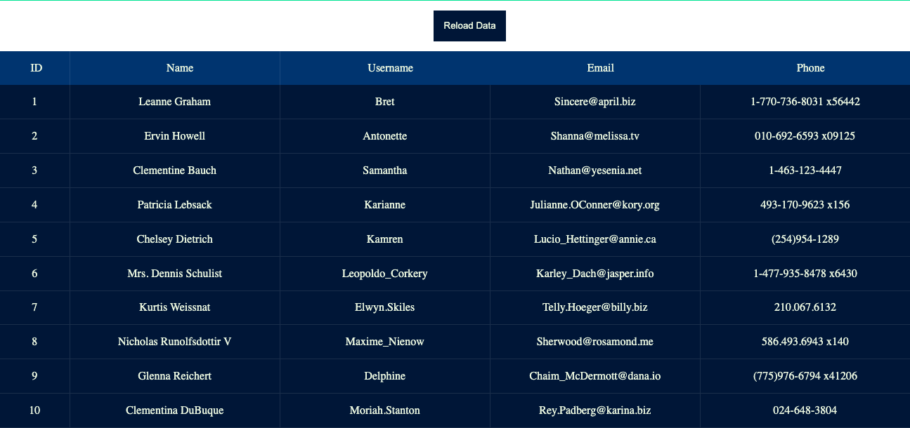

# Inpus Plugin
## Description
This is a simple Wordpress plugin written to demonstrate familiarity in wordpress plugin development.  
Code level detailed explaination of business logic is provided at js/main.js.

This plugin is developed using the following technologies -

- PHP
- Javascript (Vanilla)
- HTML
- CSS
- AJAX

As its core logic, the plugin presents an endpoint which is the only means to access it. 

 On, clicking this endpoint, a call is made to a REST api (https://jsonplaceholder.typicode.com/users) that responds with a user list in JSON format.

 The plugin processes this response and displays the following user details -  
- User ID 
- Name of the user  
- username in a table format. 
 
 Each user item listed in the table is clickable.  

 On clicking the user item, the plugin makes a call to the same REST api (https://jsonplaceholder.typicode.com/users/{user_id}), but this time it appends the user id at the end to fetch the detail of the individual user.


 Once the request is made, the response of the REST api is then listed out in the table format.  

 Following are the individual user details displayed by the plugin - 
 - Name of the user
 - Username
 - Email ID
 - Address
 - Geo location
 - Phone number
 - Website
 - Company
 - Catch Phrase
 - Business

The plugin also allows user to navigate to the previous display by providing an endpoint, which is basically a "Back" button. 

## Installation
Instllation of the plugin is as simple as running the following git command form the plugin folder in the wp-content folder of the wordpress site.  
```
$ cd wp-content/plugins
$ git clone https://github.com/vijay1996/Inpusplugin.git
```
The above command will download the required files from Inpsyde github repository to your plugins directory.  

To activate the plugin, in the wp-admin console, hover your cursor on Plugins tab on the left and click on installed plugins.  
In the listed plugins, activate the Inpus Plugin.  

Now hover over the appearance tab and click on widgets. From the left column of the Widgets page, click on Inpus Plugin, drag and drop it to the preferred section of your website (e.g, Footer, Sidebar  etc.)

This will successfully install, activate and place the plugin into your website. Now you can visit your website to try out the plugin.

## Usage
Now that you have activated the plugin, you can find find a button that looks as below -  

  

You can click the button to get a list of user. The list of users will be listed out in the following format -  



Like mentioned in the description, The items listed in the above tables are clickable. User can click the back button to move to the previous display. User can also click the reload data link to reload the list data and also the page. On clicking any of the items in the above table another table will be displayed with the details of the selected user in a format shown below - 


The user again has the option to navigate to the previous display by pressing the back buton.

## Caching
The plugin uses local storage to cache list of users returned when the first "CLICK HERE TO GET A LIST OF USERS" button is pressed. The caching logic is applied here because, on pressing this button the details displayed are the user id, name of the user and the user name. These details hardly change as opposed to the user details that change quite often. So it is a good idea to cache these details.
Even so, if required, an option to clear the local storage and reload the entire page is provided as "Reload Data link".

## Unit Testing

The plugin comes with two automated test cases -
1.  To check if hooks to load the javascript and CSS are loaded correctly.
2. To check if the plugin is registered correctly.

### Installing dependencies
The test scripts make use of the following dependencies - 
1. PHPUnit
2. Brain Monkey

To install these dependencies Composer has to be installed in the system. A simple Composer command has to be run in order to install the above dependencies.
```
$ cd Inpusplugin
$ composer install
```
Once the dependencies are installed, to execute the test cases the following command has to be run.
```
$ composer test-unit
```
This will test both automated testcases and show the result.

## Footnote

This project is built as part of a coding requirent provided by Inpsyde GmbH to test the wordpress skills of the job applicant.

Following APIs are used to fetch and display data -  
1. https://jsonplaceholder.typicode.com/users to display list of users
2. https://jsonplaceholder.typicode.com/users/{user_id} to display user-details

For any concerns or query please send a mail to vijaybhojraj.cm@gmail.com
